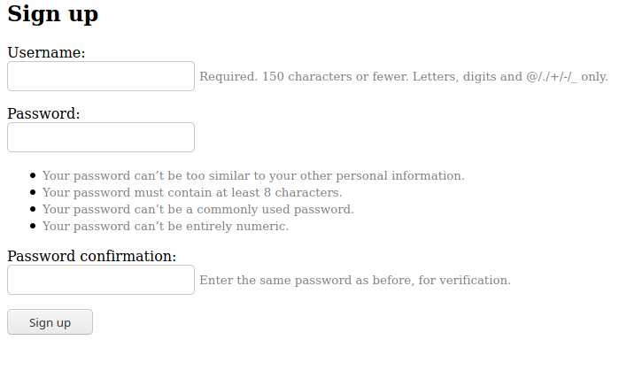
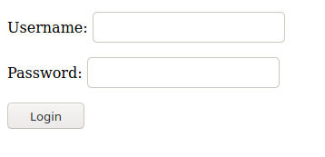
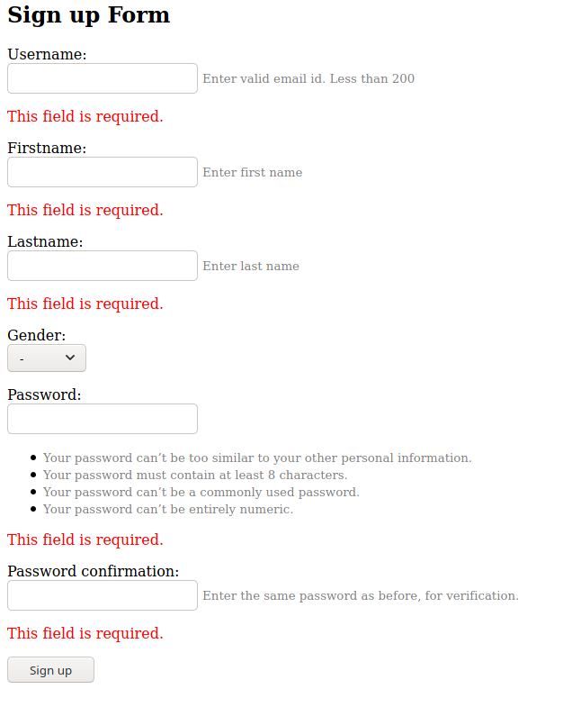
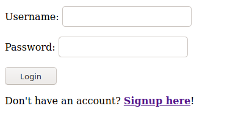

# Django: Different login ways
This repo includes two methods that can be used to create a user signup/login methods. One is using the default django library and the other is extending the available library to suite our needs or in other words a custom form.

## Table of contents
* [Clone](#clone)
* [Default](#default)
* [Custom login](#custom-login)

## Clone
To clone the repo cd the the suitable directory and through terminal run below command.
`git clone https://github.com/dhrp01/django_login.git`

## Default
In default login I have used default django authentication library. It will simply ask for the username and password with conformation to regiter the user. Then using the same username and password one can login.

To run this use: `python default_login/mange.py makemigrations; python default_login/mange.py migrate; python default_login/mange.py runserver`

## Custom login
In custom login I have extended the already present django library to include fields according to our needs. Herein we have added firstname, lastname, gender choice and also used email address as username. Using the email as username, person can login.

To run this use: `python custom_login/manage.py makemigrations; python custom_login/manage.py migrate; python custom_login/manage.py runserver`
